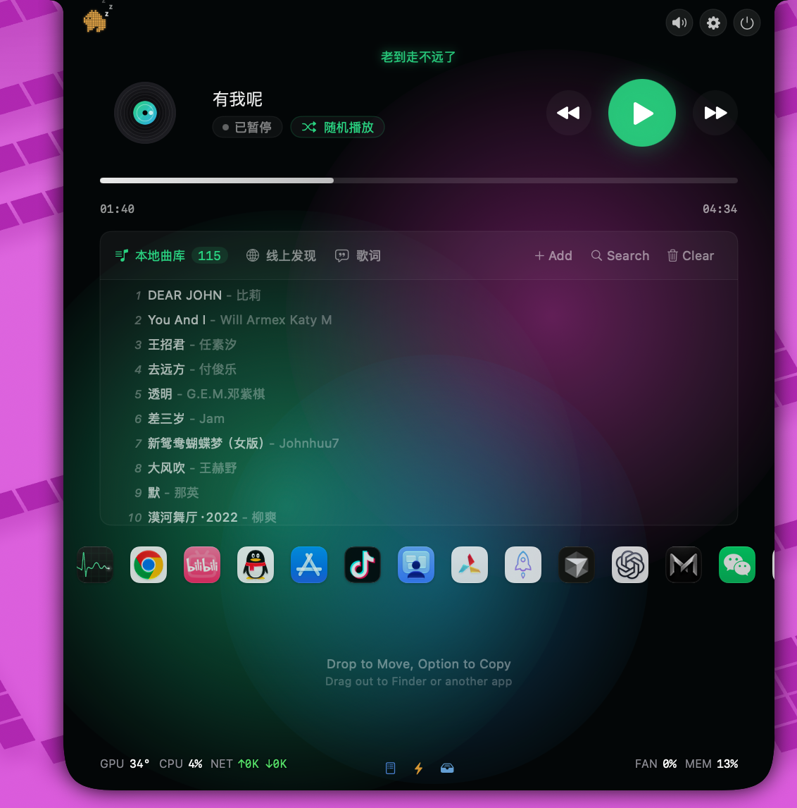
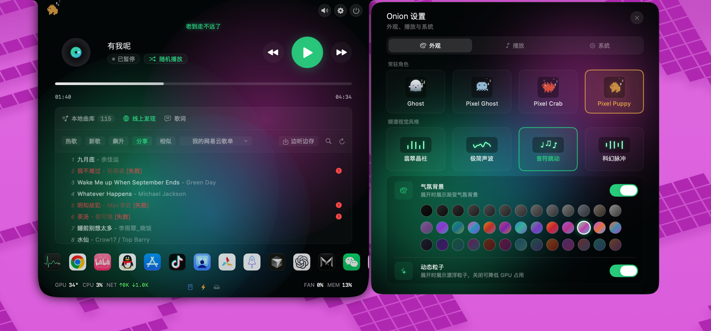
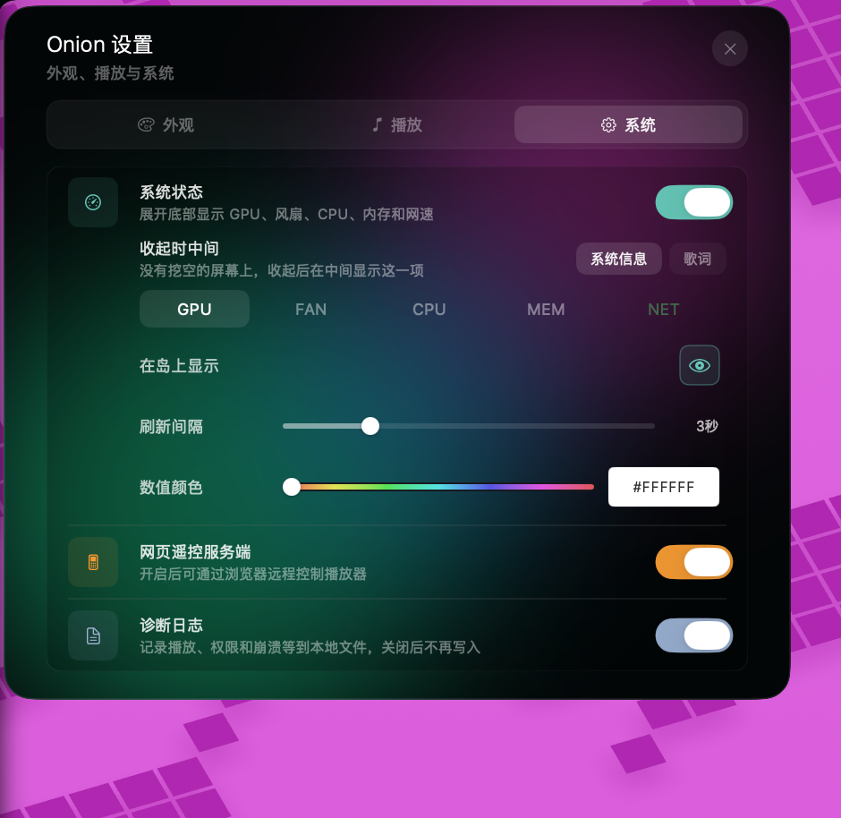

# Onion Flow

Onion Flow（简称 Onion）贴在屏幕顶部中央。收起时是一条小胶囊，能看到角色、系统状态或时间。点开以后是音乐面板：可以播本地歌曲和线上发现，看歌词，下面放常用软件和临时文件，底栏显示 GPU、风扇、CPU、内存和网速。同一局域网里可以用浏览器遥控播放。

Windows 和 macOS 都提供打好的安装包。这个仓库没有源码。

## 界面

收起后贴在屏幕顶部。

<p align="center">
  
</p>

展开后是播放器、曲库、快捷启动和系统状态。

<p align="center">
  
</p>

线上发现、角色、频谱和气氛背景。

<p align="center">
  
</p>

系统状态、网页遥控。

<p align="center">
  
</p>

## 下载

### Windows

[OnionFlow-1.6-win-x64.zip](https://github.com/onionelle/OnionFlow-download/releases/download/v1.6/OnionFlow-1.6-win-x64.zip)

64 位 Windows。解压后运行 `OnionFlow.App.exe`，不需要单独安装 .NET。

### macOS

[OnionFlow-1.0-macos-universal.zip](https://github.com/onionelle/OnionFlow-download/releases/download/v1.0/OnionFlow-1.0-macos-universal.zip)

macOS 15 及以上，Apple Silicon 和 Intel 都能用。这个包没有开发者签名。解压后执行：

```
xattr -dr com.apple.quarantine ./Onion.app
open ./Onion.app
```

程序在菜单栏和屏幕顶部中央。

## 能做什么

- 顶部贴边的岛，点击展开，再点收起
- 本地音乐：添加文件或文件夹、播放模式、进度和歌词
- 线上发现：榜单、搜索和边听边存
- Dock：把常用软件拖进去，点击启动
- Shelf：临时放下文件，再拖出去
- 局域网网页遥控播放
- 展开底部显示 GPU、风扇、CPU、内存和网速
- 可换角色、频谱和气氛背景

## 说明

本项目不提供任何音乐内容，也不与任何音乐服务商存在关联或授权关系。线上发现和在线播放是否可用，取决于第三方服务当时的策略。请只播放你有权播放或保存的内容。
